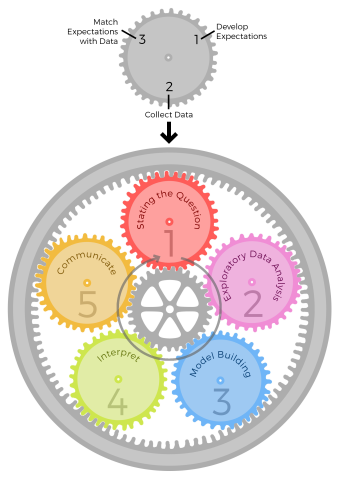
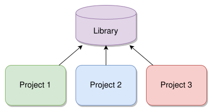
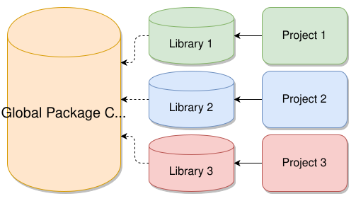
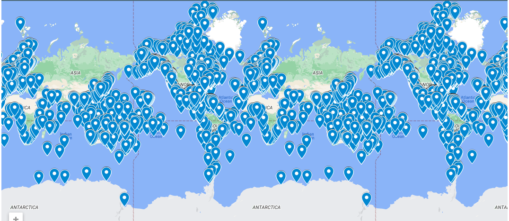
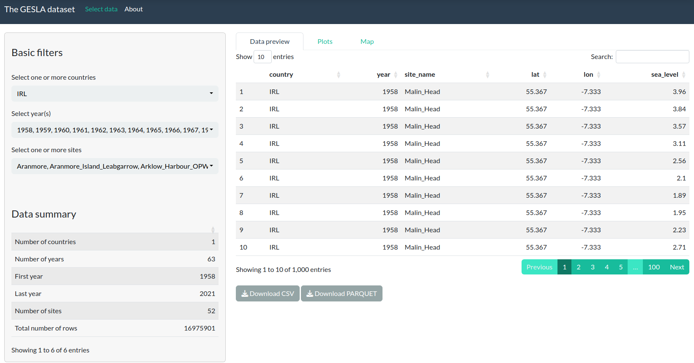
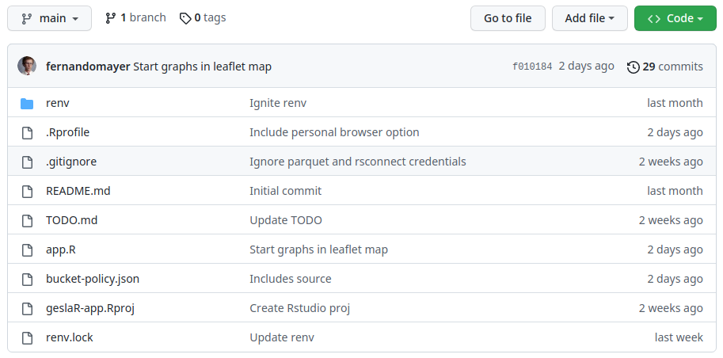

```{r, cache=FALSE, include=FALSE}
source("config/setup_knitr.R")
library(RefManageR)
BibOptions(check.entries = FALSE,
           bib.style = "authoryear",
           cite.style = "authoryear",
           style = "markdown",
           hyperlink = TRUE,
           dashed = FALSE)
bib <- ReadBib("config/refs.bib", check = FALSE)
xaringanExtra::use_xaringan_extra("tachyons")
```

class: center, middle, inverse
# Data Science workflows

---
# Data Science workflows

.pull-left[
- Data analysis **is not** a linear, one-step-after-the-other process

- Data analysis **is** a highly iterative and non-linear process

- Information is learned at each step
  - Informs whether (and how) to **refine**, the step that was just
performed
  - Informs whether (and how) to **proceed** to the next step

]
.pull-right[
There are 5 core activities of data analysis:

1. Stating and refining the question
2. Exploring the data
3. Building formal statistical models
4. Interpreting the results
5. Communicating the results
]

---
# Epicycle workflow (Peng & Matsui, 2018)

.pull-left[

For each of the 5 core activities, the following steps are critical

1. Set expectations
2. Collect data, and compare with expectations
3. Revise expectations or fix the data

Iterating through this 3-step process is called the **epicycle of data
analysis**

]
.pull-right[
```{r, out.width='70%'}

```
]

---
class: center, middle, inverse
# Elements of reproducibility

---
# Elements of reproducibility

.pull-left-60[
1\. **Data**
  - Must be provided the exact same way it was used in the analysis
  - If raw data was processed, both the raw data and the script that
  processed it must be provided

2\. **Code**
  - This automatically excludes point-and-click software
  - It must be executable all at once
  - If there are sets of files, then you need something to assure that
    they will be executed in the correct order
  - Make sure that all needed packages/software are installed (possibly
    in specific versions)
]
.pull-right-40[
3\. **Documentation**
  - Describe to humans what the code is doing (don't make people guess)
  - Describe the results

4\. **Distribution**
  - This could be to you, to your team, to your boss, or to the World
  - Share in a way that anyone can download and reproduce it
]


---
# Elements of reproducibility

The key tools are the ones that makes all the steps **reproducible** by
  **anyone** in your team

<br>

.pull-left-40[
1. Make it reproducible to you first!

2. Make it reproducible to your team

3. Make it reproducible to anyone else
]
.pull-right-60[
> *A scientific project is *computationally reproducible* if another
researcher (**including the future you**) is able to recreate all the
results, given only a set of files and instructions.*

> Justin Kitzes (2018)
]

---
# Reproducibility spectrum

- **Replicability is hard**! (Sometimes even **impossible**!)

- So, we have two options

  1. Do nothing
  2. Reproduce the study

- The general idea is to create a **minimum standard** for judging
scientific claims ([Peng, 2011,
*Science*](http://science.sciencemag.org/content/334/6060/1226.full))


```{r, out.width='70%', echo=FALSE}
knitr::include_graphics("img/F1.large.jpg")
```

---
class: center, middle, inverse
# Tools for a collaborative workflow

---
# Tools for a collaborative workflow

.pull-left-60[
<br>
<br>
```{r, echo=FALSE, out.width='90%'}
knitr::include_graphics("img/nature_toolkit.png")
```
]

.pull-right-40[
[Nature, 2018](https://www.nature.com/articles/d41586-018-05990-5)

- Use code
- Go open-source
- Track your versions
- Document your analyses
- Automate
- **Replicate your environment**
- **Archive your data**
- Get help. [Software Carpentry](https://software-carpentry.org/).
]

---
exclude: true
# Track your versions: What it isn't

.pull-left[
### What it isn't
```{r, out.width='60%'}
knitr::include_graphics("img/final.png")
```
]

.pull-right[
### What it is
```{r, out.width='60%'}
knitr::include_graphics("img/git-flow.png")
```
]

---
exclude: true
# Document your analyses: use dynamic documents

.pull-left-60[
- This concept dates back to 1984, when Donald Knuth (again) defined
  (and actually invented) what **literate programming** is
- It is a combination of a **markup language** (LaTeX, Markdown, HTML,
  etc) and one (or several) **programming languages**
  - Yes, you can mix R, Python, Bash, C, etc in the same document!
- When the document is compiled, the code is executed and you get an
  output (PDF, HTML, etc) with tables, figures, ...
]
.pull-right-40[
<br>
> *Instead of imagining that our main task is to instruct a computer what
> to do, let us concentrate rather on explaining to humans what we want
> the computer to do.*
>
> Donald Knuth, 1984
]

- Sweave, knitr, rmarkdown, Quarto, etc

---
exclude: true
# Automate: two types of automation

.pull-left[
### Code level
- Create scripts for pre-processing data
- Create functions to execute repetitive tasks
  - Bash (Shell Linux/Unix) is your friend here
- Create a routine to run scripts in a specific order
  - Create a [MAKEFILE](https://opensource.com/article/18/8/what-how-makefile)
]

.pull-right[
### Deploy level
- Use Continuous Integration (CI) or Continuous Delivery (CD) platforms
to automate, test and deploy your project
- Your routines will run in an external, pristine environment to avoid
the famous
   - "*but it works on my computer*..."
- Some examples:
  - Github Actions
  - Gitlab CI
  - Travis CI
]

---
# Replicate your environment

.pull-left[
**Virtual environments**

- Makes a project self-contained (or almost) in terms of packages
- Easy to use and record all packages used and **in their specific versions**
- Recorded packages are downloaded and installed in the first use
  - In R: `renv`
  - In Python: `venv`
]

.pull-right[
**Container virtualisation**

- Virtualisation of an environment at the **operating system** level
- Containers are isolated from each other and can have their own
  software in any specific version
- [Docker](https://www.docker.com/) is the main tool
]

**In the reproducibility spectrum:**
.center.content-box-purple[
Script < Script+Data < renv < Docker < renv+Docker
]

---
# Replicate your environment: renv

.pull-left[
### The problem
<br>
```{r, out.width='80%'}

```
]
.pull-right[
### The solution
<br>
```{r, out.width='80%'}

```
]

---
# Replicate your environment: containers

<br>

```{r, out.width='80%'}
knitr::include_graphics("img/containers.jpg")
```

---
exclude: true

```{r, out.width='40%'}
knitr::include_graphics("img/meme.jpg")
```

---
# Archive your data

.pull-left[
Use **data repositories** to share data (and get the proper credits)

- [figshare](https://figshare.com/): Allows you to publish figures,
  tables, videos, data, etc.
- [zenodo](https://zenodo.org/): Publish text and data
- [Nature recommended data
  repositories](https://www.nature.com/sdata/policies/repositories):
  Compilation of several repositories
- [re3data](https://www.re3data.org/): *REgistry of REsearch Data
    REpositories* is a tool to search for open access databases

]

.pull-right[
Make it **usable** and **accessible**, with universal formats

- Text format (csv, txt, tsv, etc) - but not always possible or feasible
- Universal formats
  - SQL and variations
  - Arrow, Parquet
]

---
class: center, middle, inverse
# The GESLA dataset

---
# The GESLA dataset

- The GESLA (Global Extreme Sea Level Analysis) project grew out of the
interests of several people in learning more about the changes of
extreme sea levels (Woodworth *et al*, 2016; Haigh *et al*, 2021)

- Sea level data were gathered all over the world from 36 data
  providers

- The current version of the database contains 90,713 years of sea level
  data from 5,119 records

```{r, out.width='65%'}

```

---
# The GESLA dataset

.pull-left[
- The whole GESLA dataset is distributed as a single zip file of 5.15 GB
  in size
- When extracted, there are 5,119 CSV files, totalizing
  38.72 GB of data
- There are a Matlab script and a Python script to deal with these files
  - They are able to read a single file (or a list of them), and made
    them available in memory
  - However, due to the huge amount of data in each file, this can be
    infeasible in any (RAM) language
]

.pull-right[
### Our goal

- To standardize the distribution of this dataset
- To make easier to fetch data without downloading everything
- To achieve that:
  - Convert CSV files to a lighter, universal and more efficient file
    format
  - Create a web interface with R Shiny to filter the data
  - Create a companion R package to fetch and deal with this data via an
    API

]


---
# The Apache Parquet format

.pull-left[
- From the CSVs and the Python script, the files were converted to the
  [Apache Parquet](https://parquet.apache.org) format
- Apache Parquet is an **open source**, column-oriented data file format
  designed for efficient data storage and retrieval
- This format can then be read by many languages (R, Python, Matlab,
etc)
]
.pull-right[
- The Parquet format can be then handled by the [Apache
  Arrow](https://arrow.apache.org) language for *in-memory* analytics
- *In-memory* here means that the computations are made efficiently in
  RAM memory, but **without** actually loading the whole dataset to RAM

```{r}
#| out.width: 90%
url <- "https://djnavarro.net/slides-data-thread-2022/img/data-interchange-2.svg"
knitr::include_graphics(url)
```
]


---
# The GESLA dataset

.pull-left-40[
- After conversion to Parquet, the whole GESLA dataset shrinked to
  7.03 GB, with the same 5119 files

- Theses files could then be stored in an AWS bucket

- The arrow R package is able to connect with this bucket, and you can
  make operations locally, without having to download the whole dataset
]


.pull-right-60[

```{r}
#| eval: false
#| echo: true
library("arrow")
path <- s3_bucket("gesla-dataset/parquet_files",
                  anonymous = TRUE)
da <- open_dataset(path, format = "parquet")
da |> nrow()/1e9
## [1] 1.172436
object.size(da)
## 504 bytes
```

]

---
# The GESLA dataset

- The web interface was developed as a "stand-alone" application,
  querying the AWS bucket

- Users can select subsets of data and download it in CSV or Parquet
  formats

```{r}
#| out.width: 90%

```

---
# The GESLA dataset

.pull-left-40[
- Besides the Parquet file format, we are using **renv** and:
  - Developing an API interface with R package **pumbler**
  - Developing a **docker** image with package, code and data
]

.pull-right-60[
```{r}
#| out.width: 90%

```
]

---
exclude: true
# References

```{r refs, echo=FALSE, results="asis"}
PrintBibliography(bib)
```

---
# Acknowledgements

This work has emanated from research conducted with the financial
support of Science Foundation Ireland and co-funded by GSI under Grant
number 20/FFP-P/8610.

.pull-left[
```{r}
#| out.width: 70%

```
]

.pull-right[
```{r}
#| out.width: 70%

```
]

```{r}
#| out.width: 20%
knitr::include_graphics("config/maynooth.png")
```


---
class: center, middle, inverse
# Thanks!
